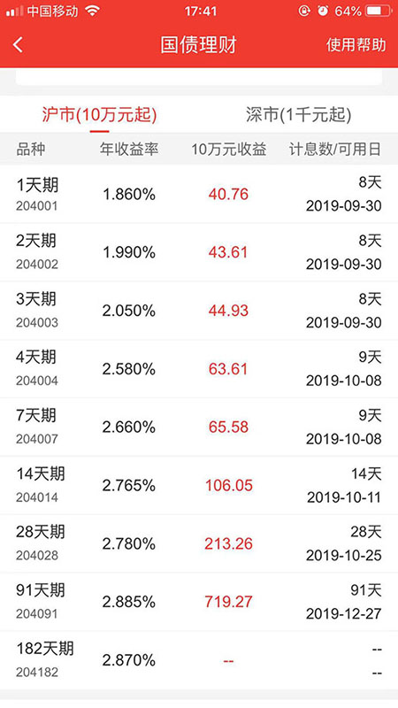

# quantlib_demo
Test quantlib, bond, repo, etc...

 [编译安装](https://www.quantlib.org/install/linux.shtml)

## TODO list

计算场景如下:

#### 现券类:

- [x] 1.  给定债券代码和债券市场,`计算债券下一付息日， 上一付息日`  
- [x] 2.  给定债券代码和债券市场 付息周期 债券类型, `计算债券久期 凸性`
- [x] 3.  给定债券代码和债券市场 清算速度 净价, `计算 到期收益率 行权收益率`
- [x] 4.  给定债券代码和债券市场 清算速度 券面总额 净价, `计算 结算日期`
- [x] 5.  给定债券代码和债券市场 清算速度 券面总额 净价, `计算 应计利息`
- [x] 6.  给定债券代码和债券市场,`计算持有到期的利息`

#### 质押式回购类:

- [x] 1.  给定回购天数 清算速度, `计算 首期结算日, 到期结算日 `

>首期结算日=  
>   成交日+清算速度 (遇节假日顺延。例如周五做了T+1的交易,那么结算日应该是下周一)  
>到期结算日=  
>   (银行间) 首期结算日+回购期限(自然日)  
>   (交易所) 成交日+(T+1)+回购期限  

- [x] 2.  给定回购天数 回购金额 利率 清算速度, `计算 回购利息`

> 回购利息=  
> (银行间)交易金额 * 回购利率 * 实际占款天数 / 365  
> (交易所)交易金额* 回购利率 * 实际占款天数 / 360  
  
- [x] 3.  给定回购天数或回购代码, `计算交易品种`

- [x] 4.  给定回购天数, `计算实际占款天数`(交易日转自然日)

#### 买断式回购类:

- [ ] 1.  给定回购利率 回购天数 首期净价, 券面总额, `计算首期收益率、到期净价、到期收益率、首期应计利息、到期应计利息`
- [x] 2.  给定回购天数、清算速度, `计算到期结算日 首期结算日`
- [x] 3.  给定回购天数, `计算交易品种`
- [x] 4.  给定回购天数, `计算实际占款天数`

备注：打 `√` 表示已完成

### 后台服务接口

暂定需要实现3个 接口的 wrapper

- 接口1

```
 入参
  债券代码 债券市场 清算速度 净价 券面总额   
 出参  
  结算日期 净价金额 应计利息 全价金额  
```

- 接口2

```
 入参 
  清算速度 回购金额 回购天数 回购利率 
 出参
  首期结算日 到期结算日 到期结算金额 实际占款天数 交易品种 应计利息
```

- 接口3

```
 入参
  清算速度 回购金额 回购天数 回购利率
 出参 
  首期结算日 到期结算日 首期结算金额 到期结算金额 实际占款天数 交易品种 应计利息 首期收益率 到期净价 到期收益率 首期全价 到期全价
```

### 参考

- 中文参考资料 [量化与固收札记](https://www.cnblogs.com/xuruilong100/p/8711520.html)




### Changelog
- Create 2019-09-25 19:26:12

 
